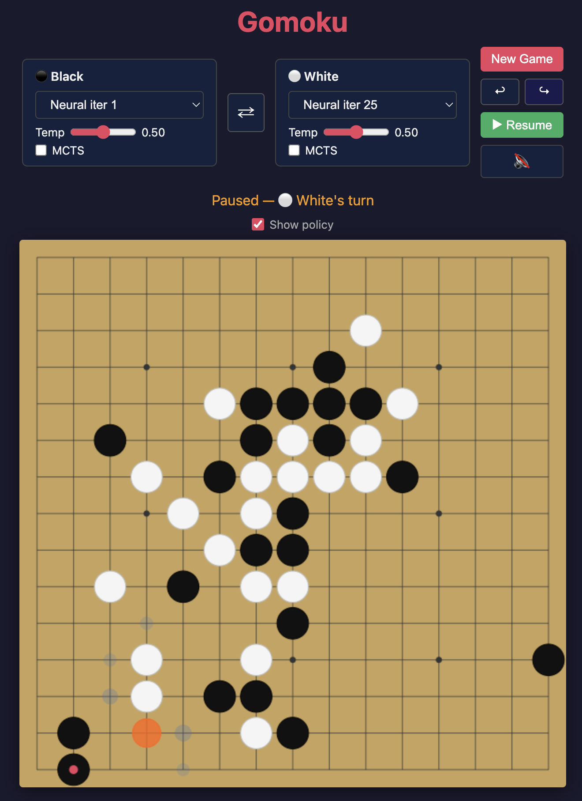

# Gomoku Web App

<p align="center">
  
</p>

A clean, extensible Gomoku (Five in a Row) game. Game state lives entirely in the
browser.

## Quick Start (Local Dev)

```bash
# Using Vercel CLI (recommended — faithfully emulates production)
vercel dev

# Or Netlify CLI
netlify dev

# Or the built-in dev server (supports neural checkpoints + MCTS)
uv run python app.py
```

Open http://localhost:5000 (or the port shown) — that's it. No database, no sessions.

## Architecture

```
public/index.html   — Single-page frontend (vanilla JS + Canvas, owns all game state)
api/move.py         — Serverless: pick a move and return action probabilities
api/policy.py       — Serverless: return action probabilities without picking a move
game.py             — Pure game engine (board state, win detection)
policy.py           — AI policy interface + implementations
app.py              — Local dev server (mimics serverless routing + neural checkpoint support)
rl/                 — RL training pipeline (network, MCTS, self-play, replay buffer, trainer)
checkpoints/        — Saved model weights from training runs
```

### How It Works

1. **Client** manages the full game state (board, current player, win detection)
2. When it's an AI's turn, client sends `POST /api/move` with the board state
3. **Server** reconstructs state, runs the policy, returns a move + action probabilities
4. Client applies the move locally and continues

No server-side sessions. No database. Fully stateless.

## Deployment

### Serverless (Vercel or Netlify)

Both platforms serve static files from `public/` and route `/api/*` to Python functions. Best for simple heuristic policies (random, smart).

```bash
# Vercel
npm i -g vercel
vercel

# Netlify
npm i -g netlify-cli
netlify deploy --prod
```

Config files: `vercel.json` / `netlify.toml` — both included, no code changes needed to switch.

**Limitation:** Serverless doesn't support neural network checkpoints well — PyTorch is too large for function bundles, cold starts are slow, and there's no persistent memory for model caching.

### With a Server (for neural checkpoints)

If you need neural-net policies (checkpoint loading, MCTS), run `app.py` on a persistent server (Fly.io, Railway, a VPS — ~$5/mo). Models stay warm in memory.

You can also go hybrid: serve the static frontend on Netlify/Vercel and proxy `/api/move` to your backend for neural moves.

## API Reference

### `POST /api/move`

Pick the best move for the current position and return it along with action probabilities.

**Request:**
```json
{
  "board": [[0,0,0,...], ...],   // 15x15 array, 0=empty, 1=black, 2=white
  "current_player": 1,           // whose turn it is
  "policy": "smart"              // which AI to use
}
```

**Response:**
```json
{
  "row": 7,
  "col": 7,
  "probs": [[7, 7, 0.85], [6, 8, 0.10], ...]  // [row, col, probability]
}
```

### `POST /api/policy`

Return action probabilities for a position without selecting a move. Useful for visualization/analysis.

**Request:**
```json
{
  "board": [[0,0,0,...], ...],
  "current_player": 1,
  "policy": "smart"
}
```

**Response:**
```json
{
  "probs": [[7, 7, 0.85], [6, 8, 0.10], ...]  // [row, col, probability]
}
```

## Adding a New AI Policy

1. Subclass `Policy` in `policy.py`
2. Implement `select_move(state: GameState) -> (row, col)`
3. Register it in the `POLICIES` dict
4. Add the option to the frontend dropdown in `public/index.html`

The function is truly stateless — each call receives the full board.
